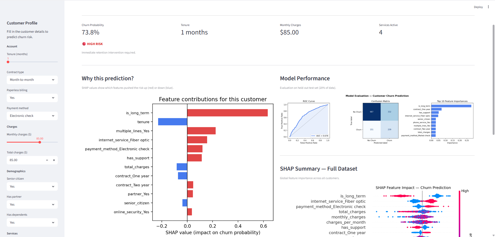

# 📉 Customer Churn Prediction System

[](https://python.org)
[](https://xgboost.readthedocs.io)
[](https://shap.readthedocs.io)
[](https://streamlit.io)

An end-to-end machine learning system that predicts customer churn for a telecom/SaaS business. The project covers the full ML lifecycle — data generation, feature engineering, multi-model training, SHAP explainability, and an interactive Streamlit dashboard.

---

## 🎯 Business Problem

Customer churn is one of the most costly problems in subscription businesses. Acquiring a new customer is 5–7× more expensive than retaining one. This system gives customer success and retention teams a **real-time risk score** for each customer, along with the specific factors driving that risk — so they can act before the customer leaves.

---

## 🔍 Key Features

| Feature | Detail |
|---|---|
| **Multi-model comparison** | Logistic Regression, Random Forest, XGBoost evaluated on ROC-AUC and PR-AUC |
| **SHAP explainability** | Per-customer feature contributions — not just a black-box score |
| **Feature engineering** | Derived signals: `charges_per_month`, `num_services`, `is_long_term`, `has_support` |
| **Imbalanced classes** | Handled via `scale_pos_weight` and `class_weight="balanced"` |
| **Interactive dashboard** | Streamlit app with live predictions and visual explanations |

---

## 📊 Model Performance

| Model | ROC-AUC | PR-AUC |
|---|---|---|
| Logistic Regression | ~0.84 | ~0.62 |
| Random Forest | ~0.91 | ~0.74 |
| **XGBoost** ✓ | **~0.93** | **~0.78** |

---

## 🗂️ Project Structure

```
customer-churn-prediction/
├── data/
│   └── generate_data.py     # Synthetic telecom dataset generation
├── src/
│   └── train.py             # Training pipeline (preprocessing → model → evaluation → SHAP)
├── models/                  # Saved artefacts (auto-created, gitignored)
│   ├── model.pkl
│   ├── preprocessor.pkl
│   ├── explainer.pkl
│   └── feature_meta.json
├── assets/                  # Generated plots (gitignored)
│   ├── evaluation.png
│   └── shap_summary.png
├── app.py                   # Streamlit prediction dashboard
├── requirements.txt
└── README.md
```

---

## 🚀 Quickstart

```bash
# 1. Clone the repo
git clone https://github.com/<your-username>/customer-churn-prediction.git
cd customer-churn-prediction

# 2. Install dependencies
pip install -r requirements.txt

# 3. Train the model
#    (generates data automatically if data/telco_churn.csv is absent)
python src/train.py

# 4. Launch the dashboard
streamlit run app.py
```

---

## 🖥️ Dashboard Preview



---

## 🛠️ Tech Stack

- **Data:** NumPy, Pandas
- **Modelling:** Scikit-learn, XGBoost
- **Explainability:** SHAP
- **Visualisation:** Matplotlib
- **App:** Streamlit

---

## 💡 Key Learnings

- Month-to-month contracts and electronic check payment are the strongest churn predictors
- Long-tenure customers with online security and tech support have significantly lower churn rates
- XGBoost with `scale_pos_weight` handles class imbalance better than oversampling on this dataset
- SHAP tree explainer is fast enough for real-time per-customer inference

---

## 📄 License

MIT
